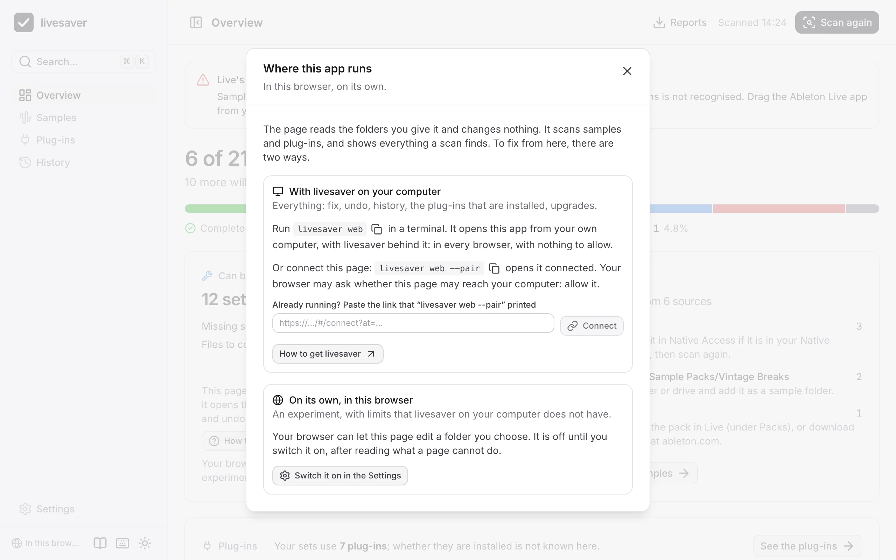
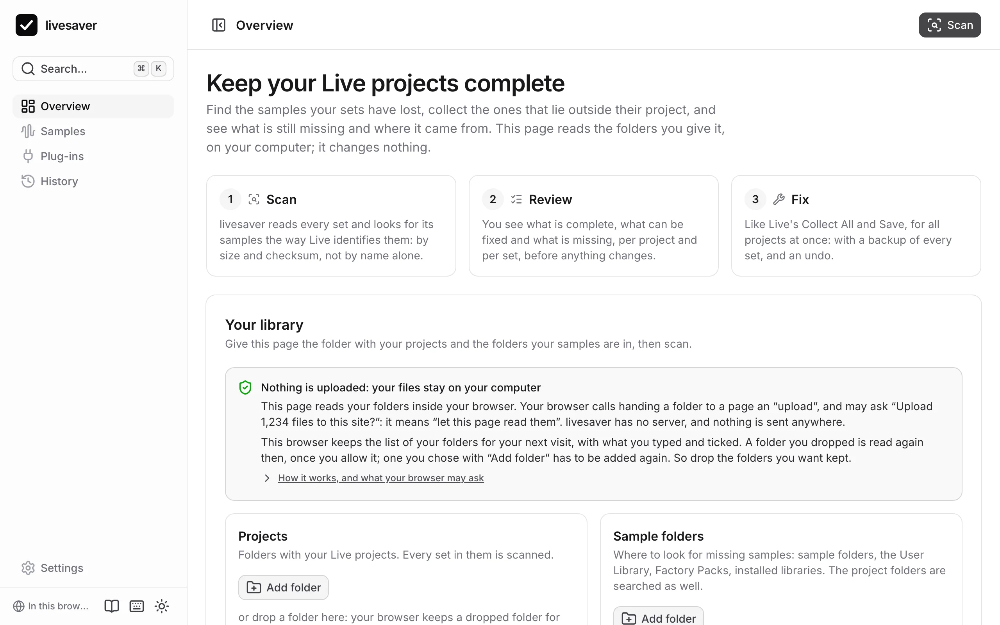
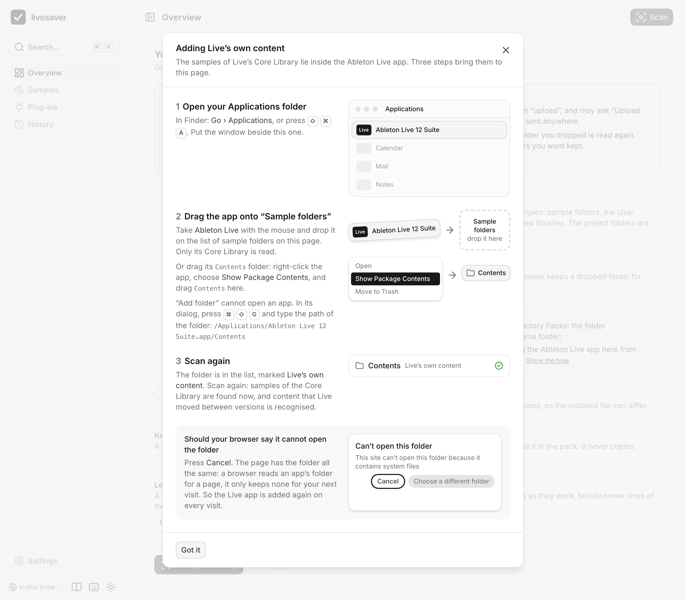

# In the browser

The app also runs on its own, as a page in your browser. It reads the folders you give it and changes nothing: good for a first look, or on a computer where you cannot install anything. In Chrome and Edge it can also fix samples and upgrade plug-ins, if you switch that on: see [Fixing in the page](#fixing-in-the-page).


## What a page can do

| | In the browser | With livesaver on your Mac |
|---|---|---|
| Scan samples: what is missing, what a fix would do | yes | yes |
| Missing samples by where they came from, with advice | yes | yes |
| The plug-ins your sets use | yes | yes |
| Whether those plug-ins are installed | once you [show it your plug-in folders](#showing-it-what-is-installed) | yes |
| Download the reports | yes | yes |
| Fix samples, undo, history | in Chrome and Edge, as an experiment you switch on | yes |
| Upgrade plug-ins to VST3 | in Chrome and Edge, with fixing switched on and Live's database folder given | yes |

What the page cannot do is said where you would look for it, with how to get it.

## Two ways to fix from the page

A page fixes either through livesaver on your Mac, or on its own. What each way needs depends on your browser:

| Browser | [Connected to livesaver](#connect-the-page-to-livesaver) | [On its own](#fixing-in-the-page) |
|---|---|---|
| Chrome, Edge | yes; the browser asks once | yes, once you switch it on in the Settings |
| Brave | once you allow the site in Brave's settings | once you switch on a flag of Brave, then in the Settings |
| Firefox | yes; the browser asks once | no |
| Safari | no | no |

In every browser, `livesaver web` opens the app from your own computer, with livesaver behind it. That needs no permission of any browser.

On the overview, **How this page can fix** says the same for the browser you are in, with the commands and the addresses of your browser's settings to copy.



## Giving it folders

Choose a folder with **Add folder**, or drop it on the page. Your browser may ask whether to “upload” the folder: that is its word for letting a page read it. Nothing is uploaded; the files stay where they are and are read there. The page says so where the folders are added, and **How it works** in that box says the rest.



The folders are on the overview: before the first scan in **Your library**, afterwards in the line of the same name, which opens into them. A folder is added and the library scanned again there, where the result is read. (The Settings have them too; a scan started there takes you to the overview.)

### How a page reads a folder

A page cannot look at your disk. It gets a folder only when you hand it one, through what browsers offer a page for that:

| You | The page gets | On your next visit |
|---|---|---|
| drop a folder | every file of it, to read (the File and Directory Entries API); in Chrome, Edge and Brave also a handle to the folder (the File System Access API) | Chrome, Edge, Brave: the folder is read again, once you allow it. Safari, Firefox: add it again. |
| choose it with **Add folder** | every file of it, to read (the folder upload) | add it again |
| allow editing, with fixing in the page switched on | the right to save into your project folder, through its handle | the same folder, once you allow it |

What your browser may ask or say:

- **“Upload … files to this site?”**: let this page read them. Nothing leaves your computer.
- **“Let site view files?”**: let the page read a folder again that you handed it before.
- **“Let site edit files?”** or **“Save changes?”**: let the page write a fix into your project folder.
- **“Can't open this folder because it contains system files”**: said of a folder of the system or of an app. Press Cancel: the page reads the folder all the same, it only cannot keep it for your next visit. (For the Live app the page no longer asks your browser what makes it say this.)

### Worth adding as sample folders

- **`Music/Ableton`** in your home folder: your User Library and the Factory Packs.
- **The Ableton Live app**: it holds the Core Library, and Live's own list of content that moved between versions.
- **`/Users/Shared`**, if you have libraries from Native Instruments.

Until Live's own content is there, the page says that samples of the Core Library cannot be found, and **Show me how** shows the steps in pictures:

1. In Finder, open your Applications folder (Go › Applications).
2. Drag **Ableton Live** from there onto **Sample folders** on the page. To a drop, an app is a folder; only its Core Library is read.
3. Scan again.



Two other ways lead to the same folder. Right-click the app, choose **Show Package Contents**, and drag its `Contents` folder onto the page. Or use **Add folder**: its dialog cannot open an app, so press ⌘⇧G there and type the path, `/Applications/Ableton Live 12 Suite.app/Contents`.

A browser keeps no folder of an app for a page, so the Live app is added again on every visit.

## Your folders on your next visit

The page keeps the list of your folders in your browser: with the paths you typed, the ticks, and how a scan matches. What it can keep of a folder itself depends on how the browser handed it over:

| The folder was | After a reload, or on your next visit |
|---|---|
| dropped on the page in Chrome, Edge or Brave | It is read again. Your browser may want to be asked first: press **Allow**. (Chrome offers "Allow on every visit".) |
| chosen for editing, with fixing in the page switched on | The same. |
| chosen with **Add folder**, or dropped in Safari or Firefox | Its row is there with its settings, and waits: add the folder again. A browser hands a page such a folder for one visit. |

So drop the folders you want kept. Two kinds of folders a browser does not keep even then, and their rows say so:

- A folder with files whose names a browser hides in a folder it keeps (a "/" as Finder shows it, or a space at the start or end of a name). Read again that way, the scan would not see those files, so the page asks for the folder to be dropped again instead, and says how many files it is about.
- The Live app.

In a private window the page keeps the list, and no folder. To make the page forget a folder, remove it from its list.

A folder that waits is not read, whether it is to be added again or your browser wants to be asked. A scan made without it counts the samples in it as not found: the page says which folders are not there before you scan, and after such a scan on every page. Allow or add the folders first; several can be dropped at once.

## Where a folder lies

A browser does not tell a page where a folder lies on your disk, but sets refer to their samples by where they lie. livesaver works it out from the sets themselves: for your project folders, and for Ableton's own (the Live app, the User Library, the Factory Packs). For another folder you can type its path (**Set path**), which makes the result the same as on the command line.

Of the Live app you can give any folder: the app itself (dropped on the page), or its `Contents`, `Contents/App-Resources` or `Contents/App-Resources/Core Library` folder. If you type its path, any path into the app will do, such as `/Applications/Ableton Live 12 Suite.app`.

## Showing it what is installed

A page cannot look for plug-ins on your Mac, but you can show them to it. In the **Settings**, under **Installed plug-ins**, add:

- **Your plug-in folder**: `/Library/Audio/Plug-Ins` (and `Library/Audio/Plug-Ins` in your home folder, if you have plug-ins there).
- **The folder of Live's plug-in database**: `Library/Application Support/Ableton/Live Database` in your home folder. Live notes there which plug-ins it scanned, by their ids.

The Library of your home folder is hidden: in the folder dialog, press ⌘⇧G and type the path, starting with `~/Library`.

Scan again, and **Plug-ins** says which plug-ins of your sets are installed, missing, or run only under Rosetta, as it does with livesaver on your Mac. With the plug-in folder alone, a plug-in is known only if its bundle says which one it is (an Audio Unit does, and a newer VST3); most VST plug-ins then count as not installed, and the page says that the database is missing.

## Fixing in the page

Chrome and Edge can let a page edit a folder you choose. With that, the page fixes on its own: the same fix as livesaver's, with a backup of every set in its project and an undo. It is an experiment, and off until you switch it on:

1. In the **Settings**, switch on **Fix in this browser**. The page lists what it cannot do; read it.
2. Drop your project folder on the page, and press **Allow editing**: your browser asks whether the page may edit it. (**Add folder** works too, but a dropped folder is read in full; see below.)
3. Scan, then **Review and fix**. The review shows where it takes your project folder to lie, and asks you to confirm that Ableton Live is closed.

**Plug-ins › Upgrade to VST3** works the same way, once the page was [shown Live's plug-in database](#showing-it-what-is-installed): from it the page knows which VST3 plug-ins Live has.

Try it on a copy of a project first.

What a page cannot do that livesaver on your Mac can:

- **It cannot see whether Live is running.** Quit Live before every fix and every undo: a set that is open in Live must not be rewritten under it. (A set that was saved between the scan and the fix is noticed, and left alone.)
- **A rewritten set loses its Finder tags and its Finder comment.** To macOS, the set a browser writes is a new file.
- **The undo is kept by the browser, for the site.** It is gone if you clear the site's data, and another browser does not have it. The backup of every set in its project's Backup folder stays, as after any fix.
- **The browser hides files with some names** in a folder it lets a page edit: a name with a “/” as Finder shows it, or with a space at its start or end.
  - A folder you **dropped** is read in full all the same: a drop shows the page every file.
  - A folder you chose with **Add folder** is not. A sample the page cannot see may well be where its set expects it, so the page takes no other file for it and leaves the set alone; it lists the sample under “Files the browser does not show”. Drop the project folder onto the sample folders as well, and the page sees it.
  - A file with such a name cannot be made either. A sample that was found and would be copied to such a name is left where it is, listed under “Names the browser does not make”; livesaver on your Mac copies it in.
- **A page has no Trash.** What an undo takes out of a project goes to a hidden folder, `.livesaver-trash`, in your project folder. Delete it when you no longer need it.
- **It does not see how much room is left** on your disk. The review says how much the copies need.
- **It needs to know where your folders lie**, because a fix writes that into the sets. It takes what the sets say: for a project folder, and for the folders with Ableton's packs and Live's own content. The review shows these places; type the path (**Set path**) if one is wrong because you moved the folder since, or if your sets say nothing about it.
- **It sees only the plug-ins you show it.** Without the folder of Live's plug-in database it cannot upgrade a plug-in to VST3.

Safari and Firefox do not let a page edit a folder: there the page only reads, and says so.

Brave lets a page edit a folder only once you switch that on in Brave itself: open `brave://flags/#file-system-access-api`, choose **Enabled**, and restart Brave. The switch then appears in the page's Settings.

### Why it is off

livesaver on your Mac has none of these limits, and it sees every file. So fixing is livesaver's job first: see [Getting started](getting-started.md#install-livesaver-on-your-mac). The page's own fix is for a computer where you cannot install anything, and for trying livesaver on a copy.

## Connect the page to livesaver

If livesaver is on your Mac, the page on the site can use it, and then does everything:

```sh
livesaver web --pair
```

opens the app on the site, connected to the livesaver that runs in your terminal. The page then reads and writes through it, on your computer; nothing of your files goes to the site.

A browser decides whether a page of a site may reach your computer, and each does it differently:

- **Chrome, Edge and Firefox** ask whether the page may reach your computer. Allow it.
- **Brave** keeps the page from it, and does not ask. Allow it once: open `brave://settings/content/localhostAccess`, add `https://polobase.github.io` to the sites that are allowed, and reload the page.
- **Safari** does not let a page of a site reach your computer. Use `livesaver web` without `--pair` there.

A browser that keeps the page back says nothing, so the page says it: livesaver does not answer, what your browser needs, and **Open the app from this computer**. That opens the same app at livesaver's own address, which works in every browser.

To connect a tab that is already open, in another browser than the one `livesaver web --pair` opened, paste the link it printed into **Where the app runs**.

The connection lasts as long as the tab and the `livesaver web` in your terminal. **Where the app runs**, at the bottom of the sidebar, says how the page is connected, and disconnects it.

## Nothing leaves your computer

The page asks no server for anything once it is loaded: no fonts, no icons, no statistics. You can check that in your browser's developer tools, and it is tested with every change to the app. See [How the web app works](../web.md).
