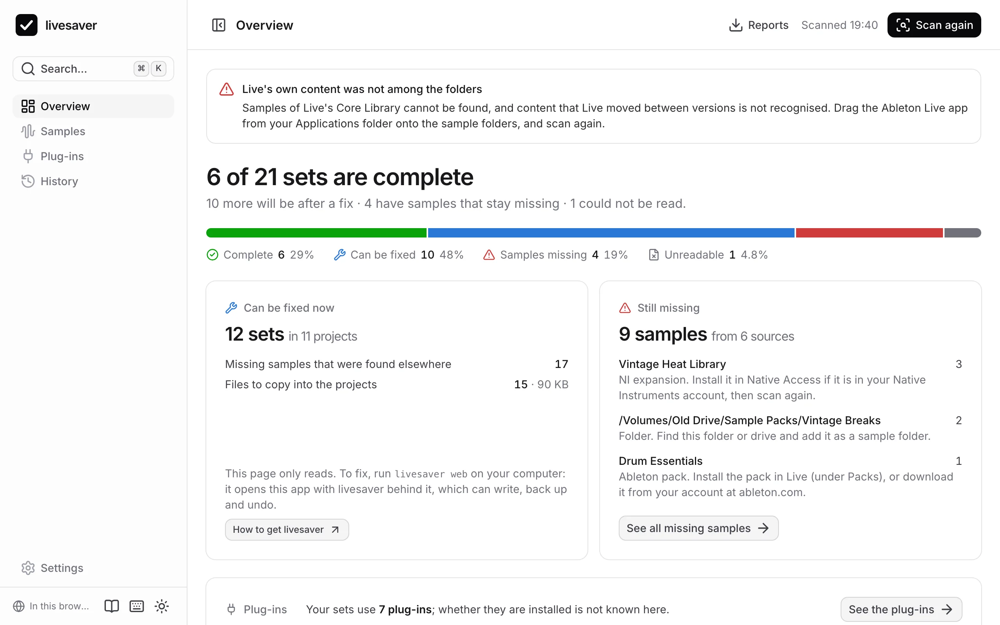

# In the browser

The app also runs on its own, as a page in your browser. It reads the folders you give it and changes nothing: good for a first look, or on a computer where you cannot install anything. In Chrome and Edge it can also fix, if you switch that on: see [Fixing in the page](#fixing-in-the-page).



## What a page can do

| | In the browser | With livesaver on your Mac |
|---|---|---|
| Scan samples: what is missing, what a fix would do | yes | yes |
| Missing samples by where they came from, with advice | yes | yes |
| The plug-ins your sets use | yes | yes |
| Whether those plug-ins are installed | no: a page cannot see that | yes |
| Download the reports | yes | yes |
| Fix samples, undo, history | in Chrome and Edge, as an experiment you switch on | yes |
| Upgrade plug-ins to VST3 | no | yes |

What the page cannot do is said where you would look for it, with how to get it.

## Giving it folders

Choose a folder with **Add folder**, or drop it on the page. Your browser may ask whether to “upload” the folder: that is its word for letting a page read it. Nothing is uploaded; the files stay where they are and are read there.

Worth adding as sample folders:

- **`Music/Ableton`** in your home folder: your User Library and the Factory Packs.
- **The Ableton Live app**, dropped on the page from your Applications folder. To a drop, an app is a folder; it holds the Core Library, and Live's own list of content that moved between versions.
- **`/Users/Shared`**, if you have libraries from Native Instruments.

Until Live's own content is there, the page says that samples of the Core Library cannot be found.

## Where a folder lies

A browser does not tell a page where a folder lies on your disk, but sets refer to their samples by where they lie. livesaver works it out for your project folders from the sets themselves. For another folder you can type its path (**Set path**), which makes the result the same as on the command line.

## Fixing in the page

Chrome and Edge can let a page edit a folder you choose. With that, the page fixes on its own: the same fix as livesaver's, with a backup of every set in its project and an undo. It is an experiment, and off until you switch it on:

1. In the **Settings**, switch on **Fix in this browser**. The page lists what it cannot do; read it.
2. Add your project folder with **Add folder**. Your browser asks whether the page may edit it.
3. Scan, then **Review and fix**. The review shows where it takes your project folder to lie, and asks you to confirm that Ableton Live is closed.

Try it on a copy of a project first.

What a page cannot do that livesaver on your Mac can:

- **It cannot see whether Live is running.** Quit Live before every fix and every undo: a set that is open in Live must not be rewritten under it. (A set that was saved between the scan and the fix is noticed, and left alone.)
- **A rewritten set loses its Finder tags and its Finder comment.** To macOS, the set a browser writes is a new file.
- **The undo is kept by the browser, for the site.** It is gone if you clear the site's data, and another browser does not have it. The backup of every set in its project's Backup folder stays, as after any fix.
- **The browser hides files with some names** in a folder it lets a page edit: a name with a “/” as Finder shows it, or with a space at its start or end. Such samples count as missing in the page, and a fix cannot copy a file to such a name; the set is then left as it is, and the page says so.
- **A page has no Trash.** What an undo takes out of a project goes to a hidden folder, `.livesaver-trash`, in your project folder. Delete it when you no longer need it.
- **It does not see how much room is left** on your disk. The review says how much the copies need.
- **It needs to know where your folders lie**, because a fix writes that into the sets. For a project folder it takes what the sets say; type the path (**Set path**) if you moved the folder since. For a folder with Ableton's packs or Live's own content you type it.
- **It cannot upgrade plug-ins**: a page does not see what is installed.

Safari and Firefox do not let a page edit a folder, and Brave does not unless you switch that on in its settings: there the page only reads, and says so.

### Why it is off

livesaver on your Mac has none of these limits, and it sees every file. So fixing is livesaver's job first: see [Getting started](getting-started.md#install-livesaver-on-your-mac). The page's own fix is for a computer where you cannot install anything, and for trying livesaver on a copy.

## Connect the page to livesaver

If livesaver is on your Mac, the page on the site can use it, and then does everything:

```sh
livesaver web --pair
```

opens the app on the site, connected to the livesaver that runs in your terminal. The page then reads and writes through it, on your computer; nothing of your files goes to the site.

- Chrome, Edge, Firefox and Brave ask whether the page may reach your computer. Allow it.
- Safari does not let a page of a site reach your computer. Use `livesaver web` without `--pair` there: it opens the same app from your own computer, which works in every browser.

The connection lasts as long as the tab and the `livesaver web` in your terminal. **Where the app runs**, at the bottom of the sidebar, says how the page is connected, and disconnects it.

## Nothing leaves your computer

The page asks no server for anything once it is loaded: no fonts, no icons, no statistics. You can check that in your browser's developer tools, and it is tested with every change to the app. See [How the web app works](../web.md).
