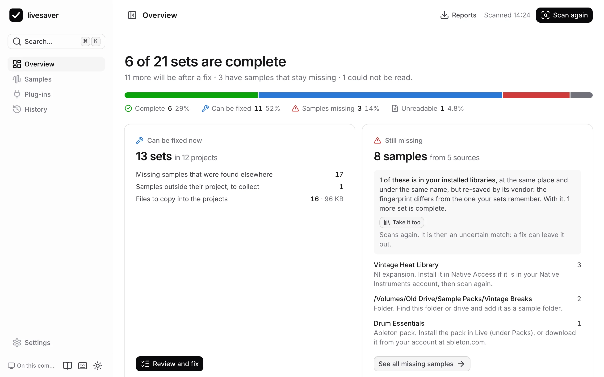

# Getting started

livesaver finds the samples your Ableton Live sets have lost, collects them into their projects, and shows which plug-ins are missing. This page takes you from nothing to your first scan.

## Two ways to use it

| | In your browser | On your Mac, with `livesaver web` |
|---|---|---|
| Scan samples and plug-ins | yes | yes |
| Fix missing samples | no | yes, with backups and undo |
| See which plug-ins are installed | no | yes |
| Upgrade VST2 plug-ins to VST3 | no | yes, with undo |
| History and undo | no | yes |
| Install something | nothing | livesaver |

Both are the same app. In a browser it can only read the folders you hand it; with livesaver behind it, it reads your disk itself and can write.

## Try it in your browser

1. Open [the app](https://polobase.github.io/livesaver/app/).
2. Give it the folder with your projects: choose it, or drop it on the page.
3. Add the folders your samples are in. Worth adding:
   - `Music/Ableton` in your home folder (your User Library and the Factory Packs),
   - the Ableton Live app itself, dropped on the page (it holds Live's Core Library),
   - `/Users/Shared`, if you have libraries from Native Instruments.
4. Press **Scan**.

Nothing is uploaded: the page reads the files where they are, and asks no server for anything. See [In the browser](browser.md) for what a page can and cannot do.

## Install livesaver on your Mac

livesaver needs macOS and either [Bun](https://bun.sh) 1.3 or newer, or [Node.js](https://nodejs.org) 22.13 or newer.

livesaver 0.1 is in preparation and not on npm yet. Until it is, run it from its source:

```sh
git clone https://github.com/Polobase/livesaver.git
cd livesaver
bun install
bun run build
bun run livesaver web
```

Once it is published, `npm install --global livesaver` installs the `livesaver` command, and everything on this site that says `livesaver …` works as written. From the source, write `bun run livesaver …` instead.

## The first scan

```sh
livesaver web
```

opens the app in your browser, at `http://127.0.0.1:5483/`. It already knows where your User Library, your packs and Live's Core Library are: it reads that from Live's own settings.

1. Add the folder with your projects, if it is not there yet.
2. Press **Scan your library**.

A scan changes nothing. It reads every set once, its samples and its plug-ins; a library of 876 sets takes about 13 seconds.



## What the overview tells you

- **How many sets are complete**, how many a fix would complete, and how many have samples that stay missing.
- **Can be fixed now**: what a fix would do, before you decide anything. See [Fix missing samples](samples.md).
- **Still missing**: the samples no folder had, by where they came from, each with what to do. See [When samples stay missing](missing.md).
- **Plug-ins**: which are not installed, which run only under Rosetta, and which can be upgraded to VST3. See [Plug-ins](plugins.md).

Nothing is written until you have seen what will change and said yes, and every fix can be [undone](history.md).
