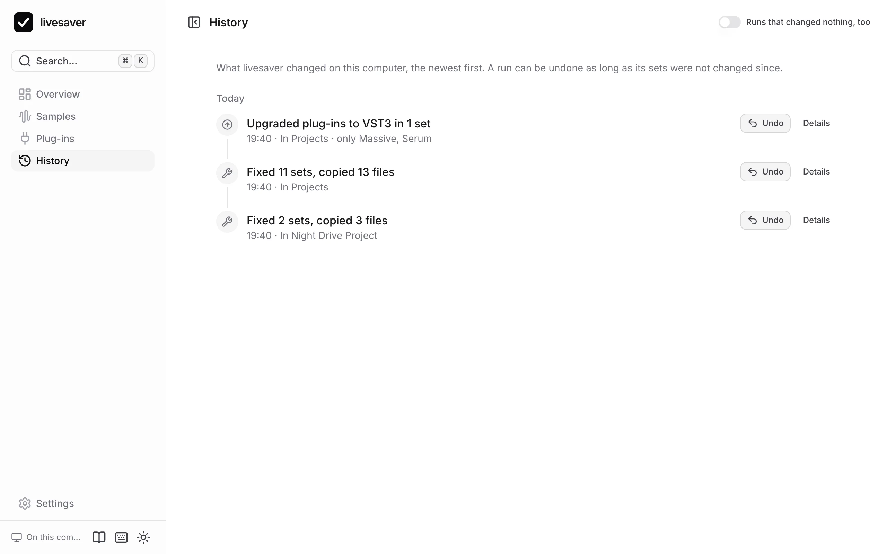
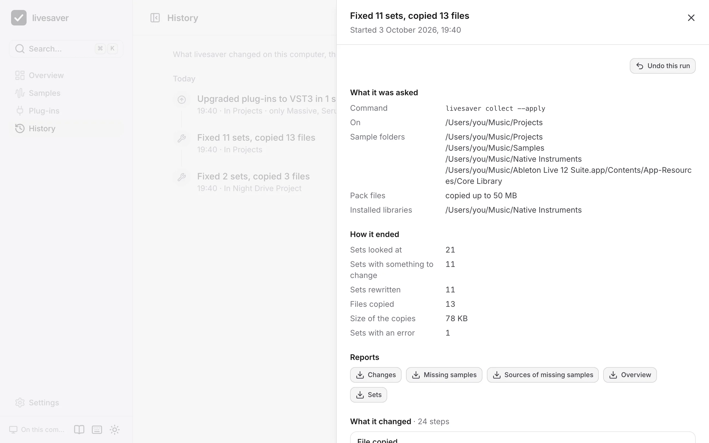

# History and undo

Everything livesaver changes is written down as a run: what it was asked, every step it took, and the original of every set it rewrote. That is what makes an undo possible, also weeks later.



## The history

**History** lists every run that changed something, the newest first: fixes, upgrades of plug-ins, and what the command line did. Switch on **Runs that changed nothing, too** to see the plans and reports as well.

Open a run to see it in full:

- **what it was asked**: the folders, the options, and the command line that does the same;
- **how it ended**: how many sets it looked at, rewrote, and how many files it copied;
- **its reports**, to download;
- **every step**: each file copied, each set rewritten, with its backup.



## Undo

An undo takes a run back:

- Every set the run rewrote goes back to what it was, from the original livesaver kept.
- Every file the run copied is moved to the Trash, unless another set uses it by now.
- A set that was changed since the run, by you in Live or by anything else, is left alone and reported. Your newer work is never overwritten.

Nothing is deleted: what an undo removes is in the Trash. Live has to be closed, as for a fix. An undo cannot itself be undone; to have the fix again, fix again.

Where to find it:

- in the result of a fix or an upgrade,
- on the overview, which offers to undo the last fix, also after you closed the app,
- in the History, for every run. There it asks first, and says what the undo will do.

## Reports

Every run writes its reports as files, which you can download from the run or from the overview:

| File | What it lists |
|---|---|
| `overview.md` | the summary: sets, references by state, sources |
| `changes.csv` | every change: the set, the sample, where it was and where it is now, how it was found |
| `missing_samples.csv` | every sample that stays missing, and the sets that use it |
| `missing_sources.csv` | where the missing samples came from, with what to do |
| `projects.csv` | every set with its numbers |

The CSV files open in Excel and Numbers.

## Where livesaver keeps this

Runs lie in `~/Library/Application Support/livesaver/runs`, one folder each: the reports, the journal of its steps, and the originals of the sets it rewrote. **Settings** shows the folder in Finder.

livesaver never removes a run. If you remove one yourself, it can no longer be undone.

## The same on the command line

```sh
# every run, with what it did
livesaver runs

# take one back
livesaver undo <run>
```
