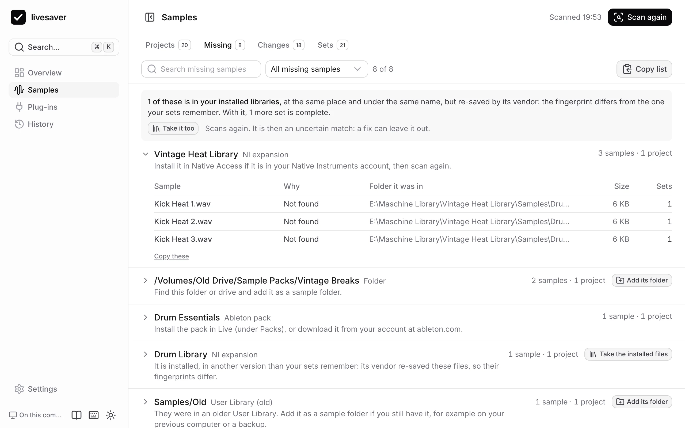

# When samples stay missing

A fix can only find what is in the folders it searches. What stays missing is listed by where it came from, because what helps differs: a pack is installed again, an old drive is plugged in, a folder is added.

## By where they came from

Open **Samples › Missing**. Each group is one source, with how many samples and projects depend on it.

| The samples came from | What helps |
|---|---|
| an Ableton pack | Install the pack in Live (under Packs), or download it from your account at ableton.com. |
| the Core Library of an older Live | Add that version's Core Library as a sample folder, if you still have it. |
| a Native Instruments expansion | Install it in Native Access, then scan again. |
| an older User Library | Add it as a sample folder: from your previous computer, or a backup. |
| another project | Add an old copy of that project folder as a sample folder. |
| the project's own `Samples` folder | Add an older copy of the project folder as a sample folder. |
| a folder or a drive | Find it, plug it in, and add it as a sample folder. |

## Add a folder and scan again

Where adding a folder helps, the group has a button for it: **Add its folder**. Choose the folder, then scan again. What the folder has is found, wherever in it the files lie now.

It does not have to be the exact folder. A whole backup drive works too: livesaver looks through all of it and recognises the files by their fingerprint.

## Installed libraries

Vendors such as Native Instruments sometimes save their samples again when a library is updated: the same audio, a slightly larger file. In a folder marked **Contains installed libraries**, livesaver accepts such a file when the audio in it is the same. `/Users/Shared` is marked from the start.

If a library was updated so that its files have other tags and another size, switch on **Also accept a library file with another fingerprint** in the settings. Such a match is [uncertain](samples.md#uncertain-matches), and listed as such.

## Why a file that is there is not taken

- **Different content**: a file of that name exists, but its audio is not the one the set used. Taking it would change your music without telling you.
- **Several candidates**: several files of that name fit, and they differ. livesaver does not guess.
- **It lies in a folder that was not searched.** Add the folder.
- **The folder could not be read.** macOS keeps apps out of some folders until you allow it. The overview says how many folders could not be read; allow access when macOS asks, or give your terminal *Full Disk Access* in System Settings › Privacy & Security.

## Take the list with you

**Copy list** copies the missing samples of a group, or of all groups, as text: name, where it was, where it came from. Handy for a search of your own, or to ask someone who may still have the files.
