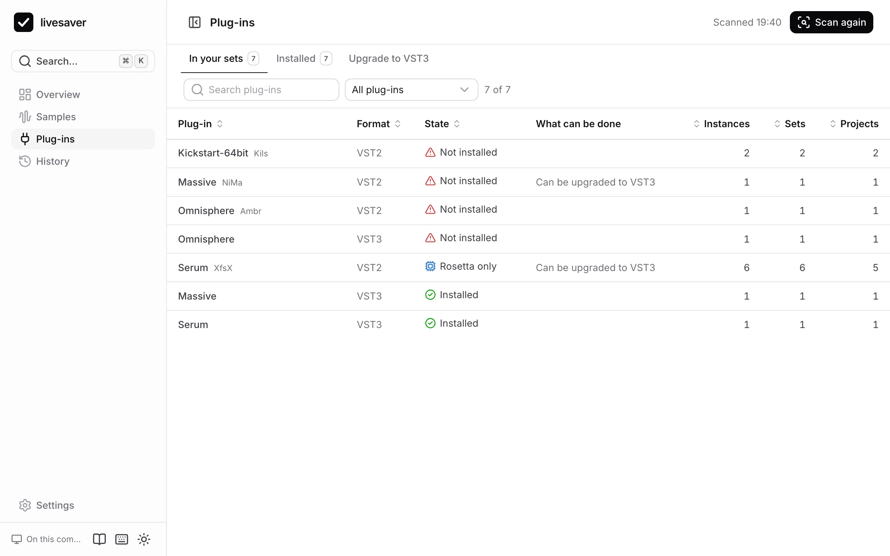
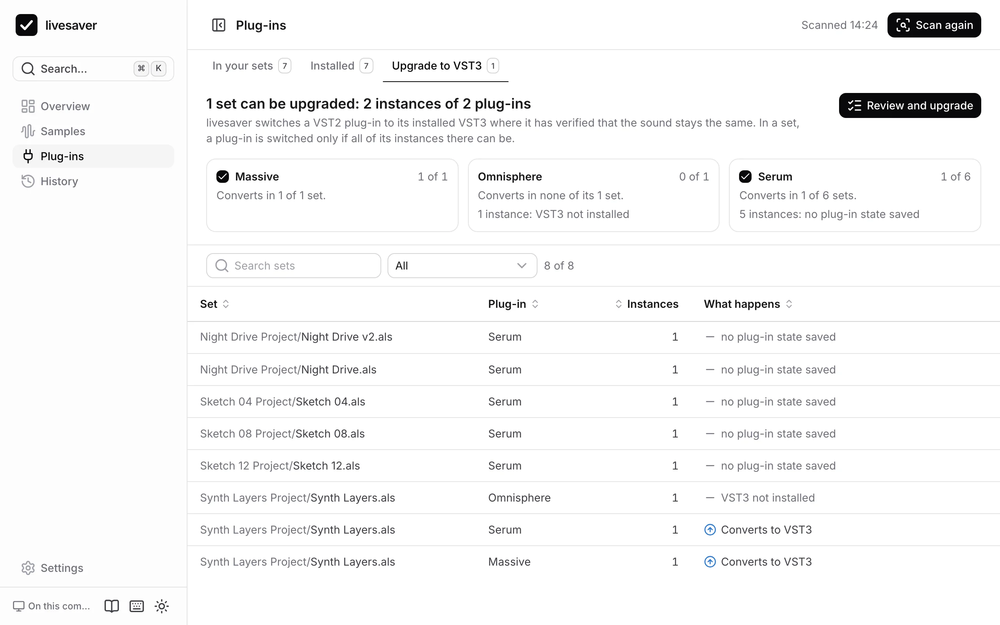

# Plug-ins

Live finds a plug-in by its format and its id, never by its name. livesaver reads which plug-ins your sets use and compares them with what is installed, the way Live does, so you know before you open a set what will be missing in it.



## In your sets

**Plug-ins › In your sets** lists every plug-in your sets use, with its format, how often it is used, and its state:

| State | What it means |
|---|---|
| Not installed | Live finds no plug-in of this format with this id. A set that uses it opens with a placeholder. |
| Rosetta only | It is installed, but contains only Intel code: Live loads it only when Live itself runs under Rosetta. |
| Installed | Live loads it. |
| Not known | In a browser without livesaver, the app cannot see what is installed. |

Open a plug-in to see what to do about it, the sets that use it, where it is installed, and whether the same plug-in is installed in another format.

Live does not switch formats by itself: a set made with the VST2 version of a plug-in shows it as missing even when its VST3 version is installed.

## Installed

**Plug-ins › Installed** lists what is on your Mac: format, whether it runs natively or only under Rosetta, its version, whether Live has scanned it, and how many sets use it.

Open a plug-in to see **what breaks if you uninstall it**: the sets that would open with a placeholder. A plug-in that no set uses, in any format, can go.

## Upgrade VST2 to VST3

VST2 plug-ins are on their way out, and many load only under Rosetta. **Plug-ins › Upgrade to VST3** switches your sets from a VST2 plug-in to its installed VST3, keeping the sound.



livesaver only converts plug-ins for which the conversion is verified against sets that Live itself saved: Massive, Serum and Omnisphere. For those, the plug-in's state is carried over exactly.

For every plug-in, the tab says what converts and what does not, and why:

| What stands in the way | Why |
|---|---|
| The VST3 is not installed | There is nothing to switch to. |
| It sits inside a rack | Its macro mappings would be lost. |
| It has automation or mappings | Only where the parameters of the VST3 are known to be the same are they kept. |
| The set is from Live 9 or 10.0 | That file format has no VST3 devices: open and save the set in Live 12 first. |
| No state was saved with it | There is nothing to carry over. |

An upgrade is reviewed first, like a fix: which sets are rewritten, and whether Live is closed. Each set is backed up, and the upgrade can be [undone](history.md).

## Where the facts come from

- Live's own plug-in database: what Live has scanned, and whether it runs natively.
- The Audio Units registered with macOS.
- Plug-in bundles in the plug-in folders that Live has not scanned yet.

See [Plug-ins in Live Sets](../format/plugins.md) for how a set stores a plug-in, and how the same plug-in is recognised across formats.

## The same on the command line

```sh
# what is installed
livesaver plugins list

# what the sets use, against what is installed
livesaver plugins audit ~/Music/Projects

# what breaks without it
livesaver plugins audit ~/Music/Projects --uninstall Massive

# a dry run of the upgrade to VST3
livesaver plugins upgrade ~/Music/Projects

# the upgrade (quit Live first)
livesaver plugins upgrade ~/Music/Projects --apply
```
