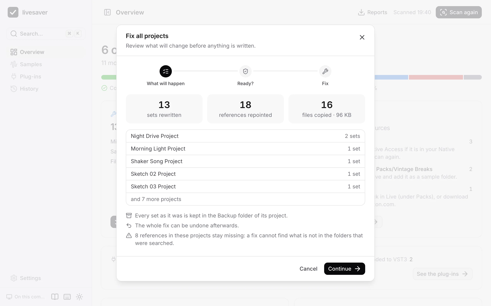
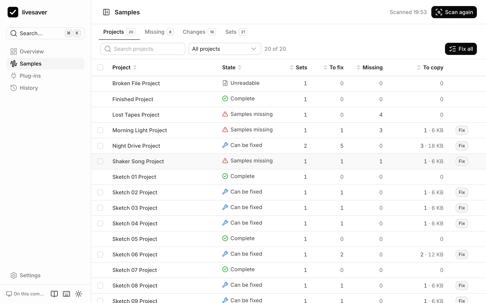
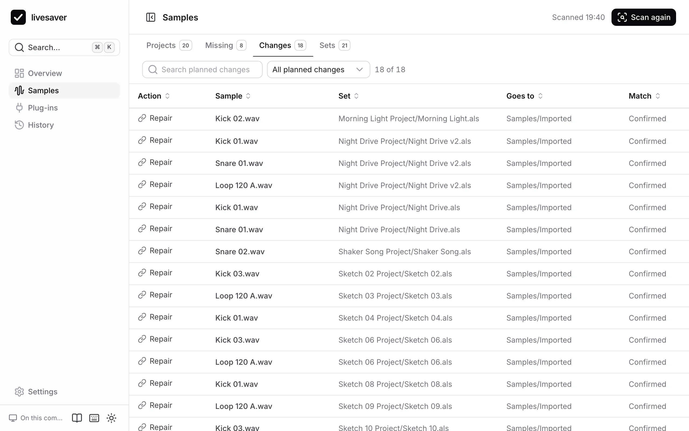

# Fix missing samples

A set that has lost its samples opens in Live with “Media files are missing”. livesaver finds the files again by what they are, puts them into the project, and points the set at them, for every project at once.

## What a scan finds

Every sample a set uses is in one of these states:

| State | What it means | What a fix does |
|---|---|---|
| In the project | where it belongs | nothing |
| In a pack or in Live | in an installed pack or the Core Library | nothing: it stays in its pack |
| Outside the project | the file exists, but elsewhere on your disk | copies it into the project |
| Found elsewhere | missing where the set says, found in a folder that was searched | copies it into the project and repairs the reference |
| Not found | no file of this name is in the folders that were searched | nothing: it stays missing |
| Several candidates | several files of this name fit, with different audio | nothing: livesaver does not guess |
| Different content | a file of this name was found, but it is not the same audio | nothing |

A set is **Complete** when all its samples are fine, **Can be fixed** when a fix completes it, and has **Samples missing** when some stay missing after a fix. A file that is not a Live Set at all is **Unreadable**.

## How a sample is recognised

A set stores, for every sample, its size and a checksum over its first 16 KB. livesaver computes the same checksum as Live does, so it recognises a file wherever it lies and whatever it is called now. The name alone is never enough: two files called `Kick.wav` are rarely the same kick.

See [Fingerprints](../format/fingerprints.md) for the details.

## Review and fix

Press **Review and fix** on the overview. Nothing is written before the third step.



1. **What will happen**: how many sets are rewritten, how many references are repointed, how many files are copied and how large they are, per project.
2. **Ready?** Live has to be closed, so that no open set is overwritten under it, and there has to be room for the copies.
3. **Fix**, then what it did, with its undo.

You can fix all projects, one (the **Fix** button on its row, or in its panel), or a selection (tick the projects, then **Fix selected**).



## What a fix does on your disk

A fix does what Live's *Collect All and Save* does, for every project:

- A sample from outside the project is copied to `Samples/Imported` in the project, with its analysis file (`.asd`). A Max for Live device goes to the project's `Presets` folder.
- The set is rewritten to point at the copy. Only the bytes of the references change; everything else in the set stays as Live saved it. In Finder the set then shows the date of the fix.
- Before that, the set as it was is copied to the project's `Backup` folder, named with date and time, as Live names its own backups.
- A file of a pack or of the Core Library that is larger than 50 MB is not copied: the set points at it in the pack. You can change that limit in the settings.

## Uncertain matches

Most files are confirmed by their fingerprint. A few are not, and livesaver says so:

- a file of an Ableton pack that was found by its name and size alone,
- a library file with other tags than the one the set remembers, which you can allow in the settings (“Also accept a library file with another fingerprint”).

In the review, a switch leaves the uncertain matches out. Those samples then stay missing, and you can decide later. If you keep them in, listen to those sets after the fix; the **Changes** tab shows which they are.



## Take it back

Every fix can be undone: from its result, from the overview, and from the [History](history.md), also days later.

## The same on the command line

```sh
# read-only: what is missing, what a fix would do
livesaver doctor ~/Music/Projects

# a dry run, with reports
livesaver collect ~/Music/Projects

# the fix (quit Live first)
livesaver collect ~/Music/Projects --apply
```

`--certain-only` leaves the uncertain matches out, and `--match-library-path` accepts library files by their name and place. See [The command line](command-line.md).
